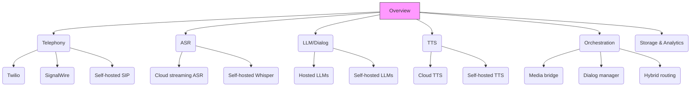

# Mindmap — Conversational Phone-line SaaS

This is a navigable, zoomable outline. Use a Markdown viewer that supports Mermaid to render the diagram.

Notes
- The `click` links assume you place detailed docs in `docs/`; I can add these files if you want.
- Mermaid is a convenient way to "zoom" by opening the linked files from nodes.